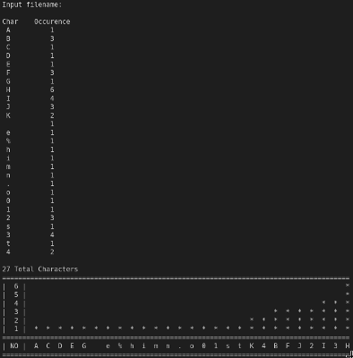

# Java Lava

My practice scripts in Java ☕

## Catalog  

### [Histogram](Histogram.java)

> This Java program will request a file and will print out the frequency of letters (upper and lowercase), numbers, and symbols i.e. all keyboard characters e.g. " " the space character too.

> Input file, [t3.txt](Histogram/t3.txt), for example output above.

### [Fraction](Fraction/Fraction.java)

> The Java class for Fraction has a number of methods, i.e. inverting, negating, checks if two fractions are equal, returning the value of a fraction as a double and adding. More details are explained in `Fraction.java`.
>
> The use of Fraction's methods are shown in the [FractionDemo.java](Fraction/FractionDemo.java) file.

### [Bank Accounts](Bank_Accounts/)

> The Bank Account folder consists of three java files. [Account.java](Bank_Accounts/Account.java) defines Account specific methods and variables i.e. to deposit/withdraw money & to check if the account number exists.
> The [Bank.java](Bank_Accounts/Bank.java) defines the Bank class, creates a bank name, to allocate the number of accounts the bank can open, opening and closing accounts of the bank.
>
> The [BankDemo.java](/Bank_Account/BankDemo.java) consicely demonstrates what the Bank.java class can do, where depending on the methods, e.g. to add money to an account, would require using the Account.java `deposit()` method.
>
> This application can be complied by running, `javac Account.java Bank.java BankDemo.java`. To start the demo, simply run `java BankDemo` in the same directory.

### [Balance Array Elements](Balance_Array_Elements/ArrayBalance.java)

> There is only one method in `ArrayBalance.java`. This method takes an array of integers and compares the sum of theses elements from each end. If the sums of both ends are equal, then the array is considered balanced.
>
> This is otherwise known as [canBalance()](https://techdevguide.withgoogle.com/resources/canbalance-problem-arrays-non-empty/) problem.

### [Online Store](Online_Store/)

<!--  -->
> This program mimics the interaction between a user and an online store.

> Option `1`, which allows the Online Store admin to add number of products to the store. In this case, only a maximum of 10 products are allowed. To see the available products for purchase, type in `2` to select option 2 i.e. _All Product Information in Store_. Finally, the user has `3` option to order a product or products by mentioning the product's number ID. This process is completed by typing `0`. Lastly, option `4` exits the program.
>
> Design Considerations:  
> Ideally there should be more than 10 products in an online store and that a user (not the store admin) should not have access to adding products to this online store. This program was built for simplicity.

### [Max Profit](/Max_Profit)

> [Stock.java](/Max_Profit/Stock.java) has only one function, i.e. `maxProfit()` that takes an array of stock prices of a particular day. This is my first attempt at the maxProfit problem, similar to [Stock Buy Sell to Maximize Profit](https://www.geeksforgeeks.org/stock-buy-sell/).  
> `maxProfit()` will return the price to buy and to sell at, that would generate the maximum profit within that given day.
>
> [Leetcode.java](/Max_Profit/Leetcode.java) contains my solution to the problem at [Best Time to Buy and Sell Stock](https://leetcode.com/problems/best-time-to-buy-and-sell-stock/description/), a code challenge on LeetCode. I consider this an improvement to `Stock.java`. However, it does not have an optimal runtime.

### [Hangman](/HangMan/Hangman.java)

> This program mimics a simple [hangman game]( https://en.wikipedia.org/wiki/Hangman_(game) ).  
> The user is allowed to define a word to guess and offer it to another player, using the same terminal where the program was executed.

<!--  -->
