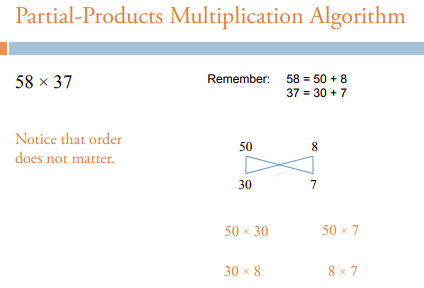

# Java Lava

My practice scripts in Java ☕

## Catalog

### [Histogram](Histogram.java)

> This Java program will request a file and will print out the frequency of letters (upper and lowercase), numbers, and symbols i.e. all keyboard characters e.g. " " the space character too.

> Input file, [t3.txt](Histogram/t3.txt), for example output above.

### [Fraction](Fraction/Fraction.java)

> The Java class for Fraction has a number of methods, i.e. inverting, negating, checks if two fractions are equal, returning the value of a fraction as a double and adding. More details are explained in `Fraction.java`.
>
> The use of Fraction's methods are shown in the [FractionDemo.java](Fraction/FractionDemo.java) file.

### [Bank Accounts](Bank_Accounts/)

> The Bank Account folder consists of three java files. [Account.java](Bank_Accounts/Account.java) defines Account specific methods and variables i.e. to deposit/withdraw money & to check if the account number exists.
> The [Bank.java](Bank_Accounts/Bank.java) defines the Bank class, creates a bank name, to allocate the number of accounts the bank can open, opening and closing accounts of the bank.
>
> The [BankDemo.java](/Bank_Account/BankDemo.java) consicely demonstrates what the Bank.java class can do, where depending on the methods, e.g. to add money to an account, would require using the Account.java `deposit()` method.
>
> This application can be complied by running, `javac Account.java Bank.java BankDemo.java`. To start the demo, simply run `java BankDemo` in the same directory.

### [Balance Array Elements](Balance_Array_Elements/ArrayBalance.java)

> There is only one method in `ArrayBalance.java`. This method takes an array of integers and compares the sum of theses elements from each end. If the sums of both ends are equal, then the array is considered balanced.
>
> This is otherwise known as [canBalance()](https://techdevguide.withgoogle.com/resources/canbalance-problem-arrays-non-empty/) problem.

### [Online Store](Online_Store/)

<!--  -->
> This program mimics the interaction between a user and an online store.

> Option `1`, which allows the Online Store admin to add number of products to the store. In this case, only a maximum of 10 products are allowed. To see the available products for purchase, type in `2` to select option 2 i.e. _All Product Information in Store_. Finally, the user has `3` option to order a product or products by mentioning the product's number ID. This process is completed by typing `0`. Lastly, option `4` exits the program.
>
> Design Considerations:
> Ideally there should be more than 10 products in an online store and that a user (not the store admin) should not have access to adding products to this online store. This program was built for simplicity.

### [Max Profit](/Max_Profit)

> [Stock.java](/Max_Profit/Stock.java) has only one function, i.e. `maxProfit()` that takes an array of stock prices of a particular day. This is my first attempt at the maxProfit problem, similar to [Stock Buy Sell to Maximize Profit](https://www.geeksforgeeks.org/stock-buy-sell/).
> `maxProfit()` will return the price to buy and to sell at, that would generate the maximum profit within that given day.
>
> [Leetcode.java](/Max_Profit/Leetcode.java) contains my solution to the problem at [Best Time to Buy and Sell Stock](https://leetcode.com/problems/best-time-to-buy-and-sell-stock/description/), a code challenge on LeetCode. I consider this an improvement to `Stock.java`. However, it does not have an optimal runtime.
>
> Leetcode.java is [BestTimeToBuyAndSellStock.java](https://github.com/Bubblemelon/code-nibbles/blob/master/leetcode/BestTimeToBuyAndSellStock.java) at my `code-nibbles` repo.

### [Hangman](/HangMan/Hangman.java)

> This program mimics a simple [hangman game]( https://en.wikipedia.org/wiki/Hangman_(game) ).
> The user is allowed to define a word to guess and offer it to another player, using the same terminal where the program was executed.

<!--  -->

### [Trapping Rain Water](/Trapping_Rain_Water/)

> [Rain.java](/Trapping_Rain_Water/Rain.java) has only one function, i.e. `waterTrapped()` that takes an array of heights (could be heights of either valleys or buildings) and returns the amount of water collected/trapped between the bounds i.e. the valleys or buildings.
>
> This function's approach iterates the array of heights from left to right and then in a separate loop from right to left. Each of these iterations store the maximum height encountered at an index of the heights array. The maximum height stored at an index of a current right or left element takes the value of its previous height unless a higher value is encountered at the heights array.
>
> The purpose is to overlay the left and right arrays over each other and then find where water can actually be stored.
>
> Having iterated in both direction solves the issue where, e.g. when iterating only from left to right, there is the possibility that the valleys begin to only decline and the method set for comparison is only to find the higher bound. This will ignore the water collected between lower valleys than previously encountered.
>
> An illustration of the above explanation can be found as comments in [Rain.java](/Trapping_Rain_Water/Rain.java).
>
> Rain.java is [TrappingRainWater.java](https://github.com/Bubblemelon/code-nibbles/blob/master/leetcode/TrappingRainWater.java) at my `code-nibbles` repo.

### [Multiplication Algorithm](/Multiplication_Algorithm/)

The **partial-products multiplication** algorithm utilizes the commutative and associative properties of addition with the distributive (grouping) property of multiplication.

> This algorithm multiplies each digit of one factor (the multiplicand) by each of the digits in the other factor (the multiplier) and taking into account each digit's place value.

This [slide deck](/Multiplication_Algorithm/UChicago_Partial-Products-Algo.pdf) by the University of Chicago shows a simple demonstration on how the order of multiplication is inconsequential, by expanding the factors' digits with respect to its place value as expressions of addition.

[PDF Source](http://everydaymath.uchicago.edu/teaching-topics/computation/)

**Standard multiplication** is the short-cut method of the partial-products multiplication algorithm. This is the 3rd grade algorithm that we are all familiar with.

[IMG Source](http://web.mnstate.edu/peil/MDEV102/U1/S8/Standard2.htm)

This method is known as [Long Multiplication](https://mathworld.wolfram.com/LongMultiplication.html), Wolfram has a comprehensive description of this method.

It is unfortunate 😟 that most students are unaware of how the standard multiplication algorithm is derived and are forced to memorize this method as is.

> [Multiply.java](Multiplication_Algorithm/Multiply.java) is an interactive program that allows the user to see the calculation between the multiplicand and multiplier, by choosing a method of computation i.e. the partial-products multiplication or the standard multiplication method.
>
> See code comments for notes on implementation.

Reason for creating this program:

My eight year old niece 👧 is to thank for creating this program. She saw me working on the terminal and curiously wanted to use it too. At the time, she was trying to master multiplication. Instantly I thought, she could learn multiplication on the terminal! 💡

The point of this program is so that she can check her calculation as she works through multiplying larger numbers. The intention was not to be a game as there are better graphical alternatives; this simply served as her reference. She tells me that she can remember the Multiplication Table a lot easier now, but this might be purely from her own determination.

I know, she could have done this on a smartphone or calculator, but using the terminal kept her motivated. It made her feel like a grown-up.

Her curiosity with the terminal is insatiable but at least now she understands the logic behind multiplication 🍎!

**Share this with curious kids you know! Even better, please improve this program!**

TODO: (1)

- [ ] fix buggy carry-over animation in short-cut method. See [VioletCucumber Repl.it](https://repl.it/@bubblemelon/VioletCucumber)

### [More Java ☕ Stuff](https://github.com/cherylfong)

See my Android app [repositories](https://github.com/cherylfong)! 📱
